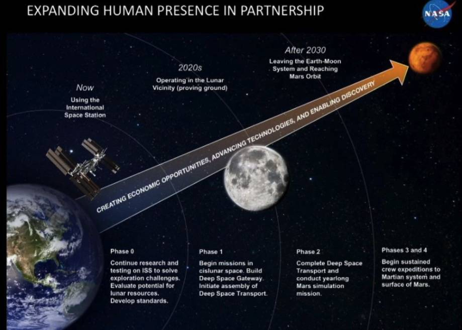

# Mission to Mars

## Overview
Web Scraping and Flask project to consolidate information on Mars from various webpages.  Results of the scrape are saved in MongoDB and displayed in one page via Flask, with a link to a separate page for images of the planet's hemispheres. 

